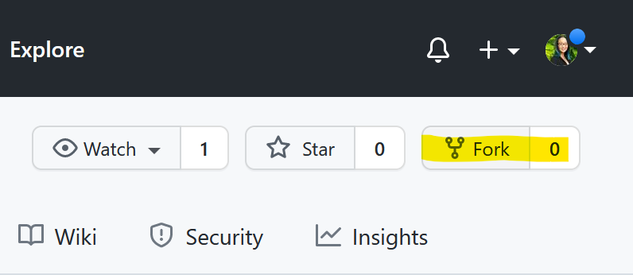
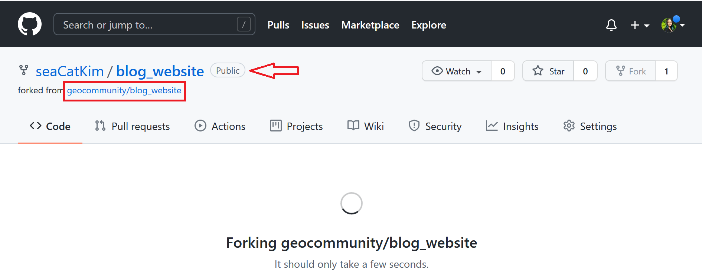
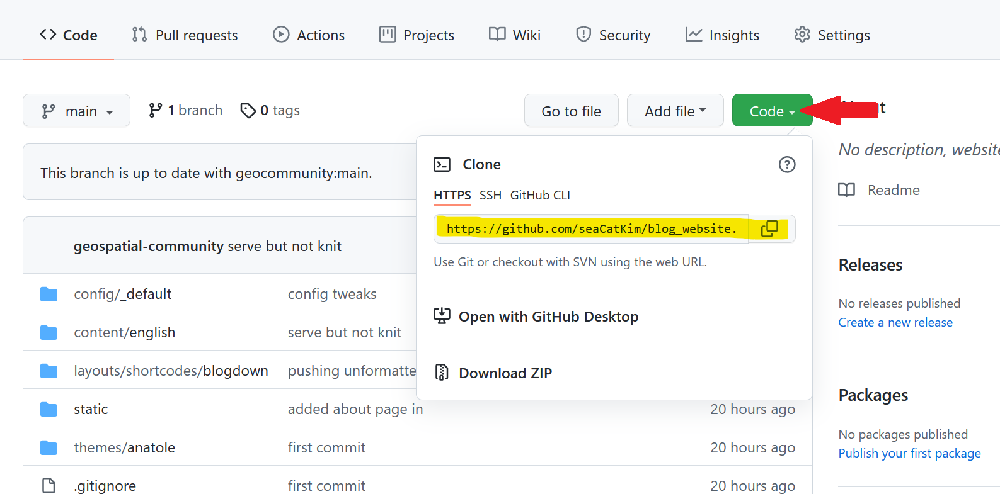
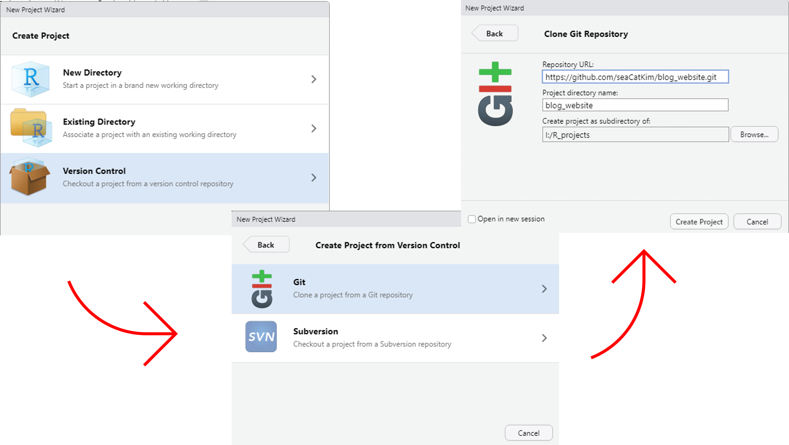
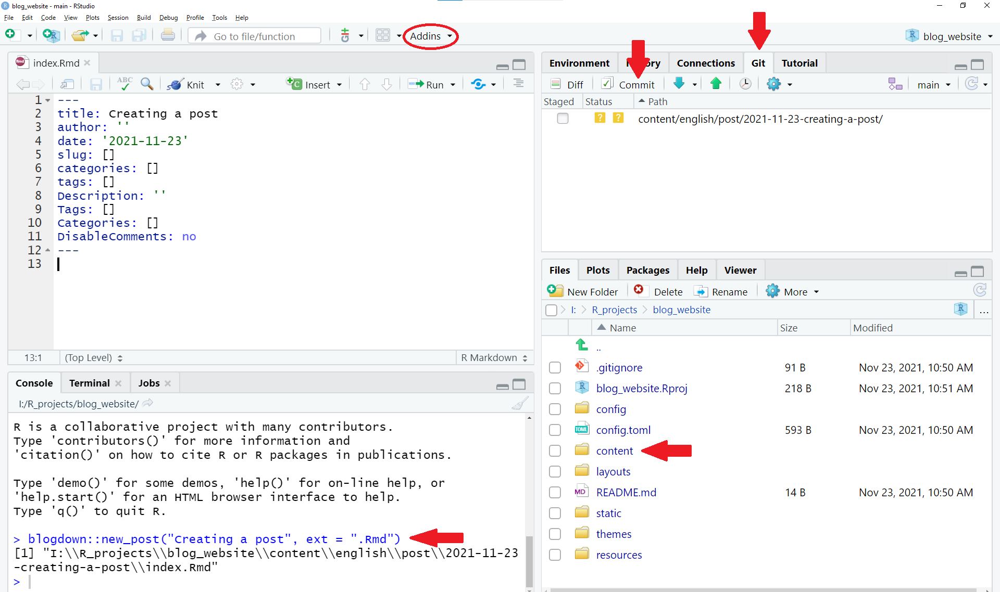
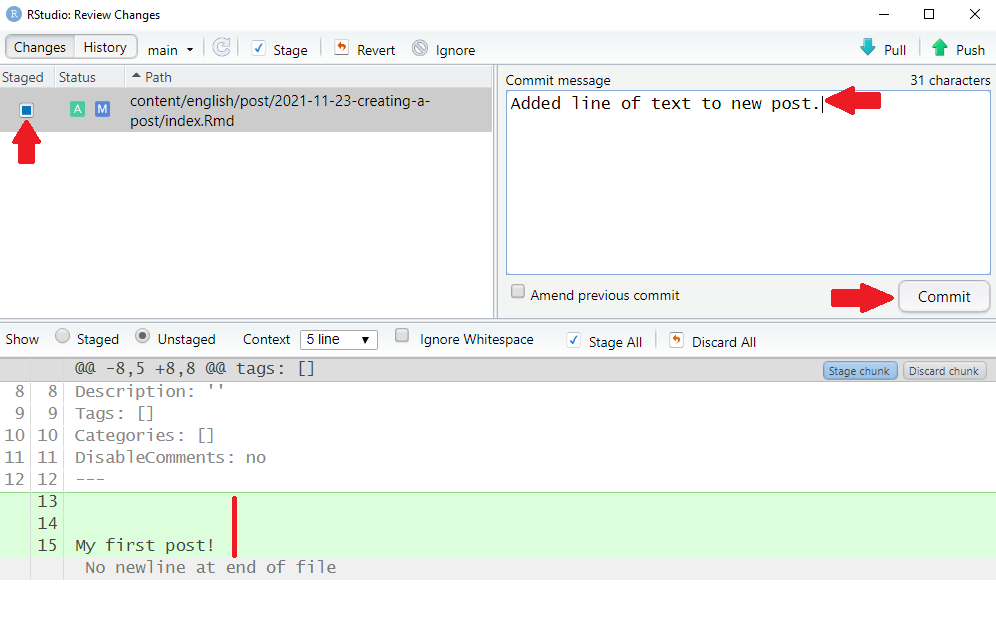
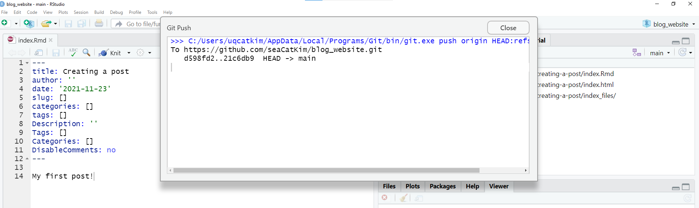
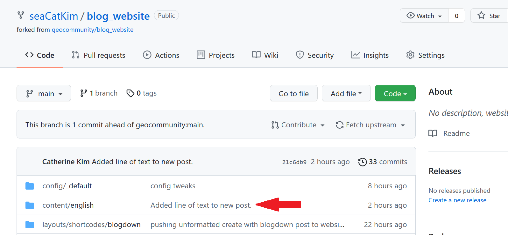
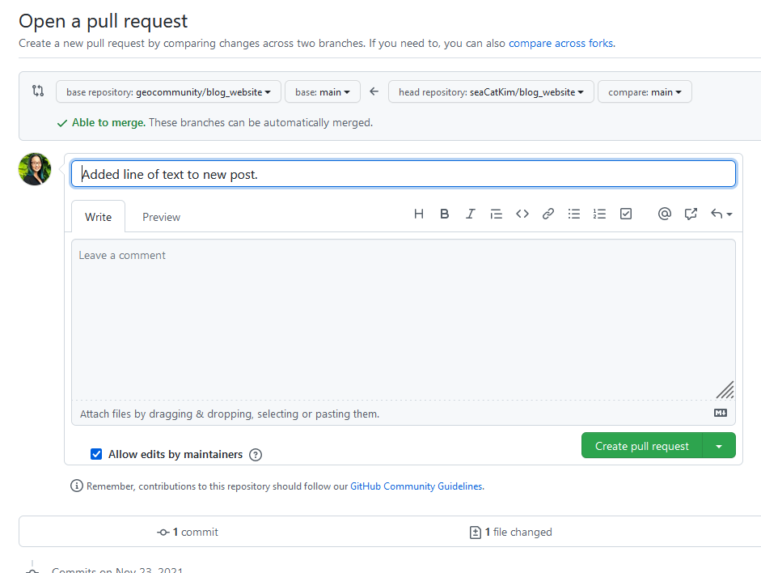

We will be covering some basics of multiple programming skills (Git/GitHub, R, html, etc...) with the aim of empowering people to contribute to blogdown websites such as the **University of Queensland Geospatial Analysis Community of practice (UQGAC)** blog. The idea is to encourage community members to contribute material directly instead of funneling everything through a website administrator.

## Geospatial Analysis Community of Practice - The University of Queensland (UQGAC)

Unveil the new **website**!

Point of contact - Mitchel Rudge
mitchel.rudge@uq.edu.au

## Creating a post on the UQGAC website

**Catherine Kim, PhD**  
Postdoctoral Associate, School of Biological Sciences  
Technology Trainer, UQ Library  
Twitter: @fishiintheC  

What we will cover:

1. blogdown basics
2. Git and GitHub basics
3. How to create a post on the UQGSAC blogdown website
4. R Markdown basics

I have pieced this together using many other resources on the above which are mentioned throughout.

What you will need:

1. Installations - R, RStudio, Git
2. A GitHub account (free) with your login details handy

## blogdown basics

`blogdown` is an  R package that allows the creation of websites using R Markdown and Hugo, a static site generator. `blogdown` websites in R have been all the rage the last few years and you have probably seen many 'Hugo-Academic theme' personal websites - all built in R!


- There is a [short online book](https://bookdown.org/yihui/blogdown/yihui-xie.html) on blogdown written by the developer, Yihui and others.
- A recent [article by Allison Hill](https://www.apreshill.com/blog/2020-12-new-year-new-blogdown/) on starting your own blogdown website from scratch. 
- See [Mitch and Stéphane's tutorial](/post/creating-a-geospatial-blog-with-blogdown/) for UQGSAC on creating a blogdown website.

**This session focuses on how to go about *contributing* a post to an existing website.**

The UQGSAC website is built using the anatole theme. There are many themes to choose from and if you know html/CSS you can even build your own theme.

So, how do we go about contributing to a blogdown website?


A good place to start is making sure you have installed the `blogdown` package:

```{r eval = FALSE}
install.packages("blogdown")
```

[Article](https://bookdown.org/yihui/blogdown/global-options.html) about setting global options in `blogdown` if you need to set the Hugo version in your `.Rprofile` (`blogdown::config_Rprofile()`). 

To allow multiple people to contribute to the same website, the website is hosted on **GitHub** and **Netlify**.

As the website is already set-up, we will be dealing with Git + GitHub and R + RStudio + R Markdown.

## Git - what is it?

A **version control software** (think track changes) useful for collaborating on and sharing code.

Git is the *software itself* that records changes to a set of files locally. There are several hosting platforms that are like online repositories (think Dropbox, Google Drive, etc.) that work with Git: Bitbucket, GitLab, and GitHub to name a few.

These platforms not only allow for version control but also to collaborate, organize, and back up projects. 

In this case, we will be using **GitHub** to access the website files, make some changes (i.e., add a post), and then incorporate those changes back to the website repository on GitHub which will automatically update the website itself. `r emo::ji("raised_hands")`

We will focus on contributing a post to an existing website repository on GitHub, but there are lots of fabulous and free resources online that go more into depth on Git:

- If you need to be convinced to use Git for version control see this [article](https://peerj.com/preprints/3159v2/) and [Happy Git and GitHub for the useR](https://happygitwithr.com/index.html) to git started both by Git/R guru Jenny Bryan.
- See Caitie Kuempel's R Ladies Brisbane [presentation](https://github.com/cdkuempel/getting_started_github) on getting started with GitHub in RStudio.

### Git Terminology

**Repository/repo** - where a project is stored in GitHub. Think of it like a folder holding all the relevant documents that you can version control, view history, and add collaborators. The repository or repo holds all the relevant files for the website - most of which we will not touch.

**Fork** - A copy of another user's repo on your account. This allows you to freely change a project without affecting the original upstream repo. You can keep your fork synced with changes in the original repo. - this is *fetching upstream*.

**Clone** - a copy of a repository that lives on your computer instead of a website server like GitHub. Is still connected to the remote repo online and you can push/pull edits.

**Commit** - is one or more changes to a file or set of files that you are asking GitHub to keep track of.

**Push** - sending your committed changes to a remote repository on GitHub. Local changes updated on the GitHub website where other people can access.

**Pull** - incorporating and merging changes. An edit on the remote repository on GitHub can be pulled to a local repository.

**Diff** - difference, or changes made that are visible as insertions/deletions for a commit.

**Main/Master** - the default branch you are on. Master has recently updated to main, but they are the same thing. You are more likely to come across master on older resources. [Jenny Bryan](https://happygitwithr.com/git-branches.html) strongly urges you to create a new **branch** to work off of which requires using command line. For the purpose of contributing to a blogdown website, I will forgo covering this as it is unlikely more than one person will be contributing at the same time.

**Origin** - the remote repo online from which you have cloned your local copy from. 

## How to create a post in blogdown

Starting with Git and GitHub:

### 1. Fork the repo

- Sign in with your GitHub account 
- Go to the [geocommunity/website repo](https://github.com/geocommunity/website)
- Press the **'Fork'** button at the top right.

- A *forked* copy of the repo should now be visible in your GitHub account. `YOU/blog_website` is the **origin** for your local copy of the repo in RStudio and `geocommunity/blog_website` is the **upstream** repo.



### 2. Clone the repo in a new RStudio project

- You will need your GitHub credentials handy.
- You can also set up RStudio so you do not need to input your GitHub credentials every time.

From your forked repo, click on the green 'Code' button and copy the link in the pop-up window.



Next, in RStudio, go to `File > New Project`. In the pop-up window, click the last option 'Version Control' and then 'Git'. In the following window, paste the url you copied from your forked GitHub repo in the first box which will automatically input the name of the project. 



Conceptually, what we have done is:

    
Now that we have *cloned* the repository, let's explore the file structure a little in the 'Files' tab in RStudio. It is NOT a very intuitively set-up even for intermediate users of R. For the purposes of creating a new post to add to the blog, we are mostly concerned with the `content/english/` directory that contains the `post/` sub-directory.

The rest of the files are the 'backend' of the site using html, CSS, js, etc. to build the website. Have a look if you are curious but make changes at the risk of being 'that person' to break the site! But don't worry, since we are using Git version control all changes are tracked and reversible.

Now that we are somewhat familiar with the project structure, let's create a new post.

### 3. Create a new post

In our new RStudio project housing our *forked* and *cloned* GitHub repo of the website:

Use `blogdown::new_post("New post name", ext = ".Rmd")` in the console to create a new post with a .Rmd extension. Alternatively, you can go to the `Addins` button under the menu and choose 'New Post' under the BLOGDOWN section and fill in the information in the pop-up window.



- This will create a new page/post bundle folder or sub-directory within `post/` with the date and the name given in `new_post()` function. e.g., `post/2021-11-18-New-post-name`.
- An index.Rmd file has been opened and only contains a YAML header (enclosed by `---`). More on that later. Do not change the name of the .Rmd file.
- Each post gets its own bundle which is where your static post-specific files like images or data (.csv files etc.) used in your post should go.
- Note that the "New post name" will not only be the incorporated into the sub-directory name, but also the url to the post. Read: choose wisely and concise > long descriptive name.
- This "New post name" will automatically be filled as the 'Title:' in the .Rmd YAML heading. If you want a longer, descriptive title - change it in the YAML heading. 
- It is recommend you use either `blogdown::new_post()` or the Addin to create a new post instead of manually creating a new file (File > New File > R Markdown script)

Here, we will stick with the .Rmd extension, but know there are a few file types:

**.md - markdown**, cannot run code chunks  
**.Rmd - R markdown** -> rendered to .html using Pandoc  
**.Rmarkdown - also R markdown** -> compiled to .markdown documents  

If you want more of this detailed stuff see: <https://bookdown.org/yihui/blogdown/output-format.html>.

### 4. **Commit** the changes i.e., the new post

Let's commit our new post. You can add something like a line of text, or not.

- If you cloned the repo properly there should be a `Git` tab in the upper right hand window in RStudio where the `Environment` is. In the Git repo, there should be some files listed (i.e., `post/2021-11-23-New-post-name`) with different colored boxed under the 'Status' column - hover with the cursor to see what they mean. 
- Check the 'Staged' box for the files you want to include in this commit.
- Click the `Commit` button and a window will pop-up. In the bottom section, you will see the changes made to the file as additions (green) and deletions (red) - this is known as the **diff** in GitHub speak. For a new file, the whole thing will be green because it is all new.
- In the 'Commit message' box, add a concise but descriptive message of the changes like 'Added a new post bundle.' Once you are happy with everything (file staged, commit messages, etc.) click the 'Commit' button.



Some stuff will happen and as long as you do not see any obvious errors then it has probably all gone well and you've made your first commit!


Knowing when and how often to commit is a bit of an art that comes with experience. In general, you want to commit changes that are related to a single problem and a good commit message. There is also a `History` button on the top left corner that will list all the commits with messages you have made and you can view the diff by clicking on a commit. All commits have a unique code which you can use to return to a previous commit etc.

**Important notes:**

- Once you have served the site (see Step 6) it will create additional files within your post bundle directory. Be sure to commit **all files** in the post bundle created when knitting (/index.html, /index_files, etc.) not just the `index.Rmd` file as they will be necessary to build the site from GitHub. - You can stage them all together as one commit. 
- You will not be able to see diffs in the commit window until they have been **saved**.

See more on committing and [best practices](https://r-pkgs.org/git.html#commit-best-practices) from the R packages book.


### 5. **Push** the changes to GitHub

The changes and commits we have made are local, but we need to get them onto the GitHub repo and then the website. This is where we need to **push**.

In the `Git` window, you will see a blue down arrow for **pull**ing and a green up arrow for **push**ing. You will also see a message along the lines of `Your branch is ahead of 'origin/main' by X commits` under those buttons. 

For the purposes of contributing a post to a blogdown website, we will not worry about pulls and *fetching upstream*.  This basically means keeping your `origin/master` repo synced with the original upstream repo that you forked. 


If you stick to creating a new post bundle and **only modifying files within the post bundles** it should be okay without fetching upstream. BUT know that if you are using GitHub to work collaboratively, staying current with the original repo is important and in general it is a good practice to always **pull before** you **push**. Recommend [Happy Git and GitHub for the useR R](https://happygitwithr.com/fork-and-clone.html) as a trusty guide.

If you want to try **fetching upstream** it is easiest to do via GitHub. Followed by a **pull** in RStudio.

- Log into your GitHub account online, and navigate to your `YOU/blog_website` repo.
- Under the green `Code` button, there should be a `Fetch upstream` button that will sync your forked repo with the original upstream repo.
- There is information about the status of your branch compared to the original upstream repo e.g., 'up to date' or 'X commits ahead/behind' to give you an idea if you need to fetch or not.
- Now in RStuiod, you should be good to **pull**.
- Revisiting this diagram, the *fetch upstream* is updating your forked repo from the origional orange repo and then the pull is updating your local repo from your forked repo.


Now we will *push* our commits from or local repo to our remote `origin/master` repo on GitHub. If you see `HEAD -> main` then all good.



Now if you go back to your GitHub account and forked repo online, you should see the changes you made locally are now in the remote online repo and your commit message. 



In general, you should **commit** often and then **push**.

### 6. Serve the site

In the console, run `blogdown::serve_site()`. Alternatively, can click on RStudio 'Addins' and select 'Serve Site'. Be patient, but what happens? 


Some important information on what is going on from [blogdown: Creating Websites with R Markdown](https://bookdown.org/yihui/blogdown/a-quick-example.html#serve-site):

> Serving the site did the following:
>  1. Started a local Hugo server to help you preview your website, and
>  2. Knitted a sample `.Rmd` post to an `.html` page. You can see this from the progress message that printed to your console: `Rendering content/english/post/2021-11-23-creating-a-post/index.Rmd... Done`

You can also view the locally served website in a browser by clicking on the "Show in new window" button at the top left of the RStudio Viewer pane to the right of the broom.

Serving the site is using something called **LiveReload**:

> Let’s introduce an important and helpful technology that you just used: LiveReload. Serving your site uses LiveReload, which means your website will be automatically rebuilt and reloaded in your web browser when you modify any source file of your website and save it. Basically, once you launch the website in a web browser, you do not need to rebuild it explicitly anymore. All you need to do is edit the source files, such as R Markdown documents, and save them. There is no need to click any buttons or run any commands. LiveReload is implemented via blogdown::serve_site() and Hugo, and you will only need to use it once per work session.

Remember, *every time* you **save** your .Rmd file will activate the *LiveReload*. To stop serving the site locally run `blogdown::stop_server()` in the console.

### 7. Create your content 

Once the website is set-up, forked, and cloned... you can get on with creating a new post with minimal coding. The main thing you will need to use is:

#### R Markdown

This is an R Markdown document. Markdown is a simple formatting syntax for authoring HTML documents that we can incorporate into the website. For more details on using R Markdown see <http://rmarkdown.rstudio.com>.

When you click the **Knit** button a document will be generated that includes both content as well as the output of any embedded R code chunks within the document. For a website post, knitting is not as important because we can serve our site locally which automatically knits anything new and view the changes as we just learned `r emo::ji("point_up_2")`.

Now let's add some information about R Markdown:

##### YAML header

The YAML, or Yet Another Markdown Language, header at the top of the .Rmd is set between `---` tags. Here is where information like the Title, Date, Author of the document go and will appear in the post.

Have a look at previous posts and add any relevant tags or categories as you like. 

The default .Rmd has some redundant settings (tags vs Tags) so if you use them stick with the lower case settings.

##### Formatting

Can **bold** and *italicize* text.

**Headings:**

Can specify headings using # marks. The number of has symbols corresponds to the level of the header (2 hashs = level 2 header)

This will also create a structure outline of your document you can navigate either by using the 'Formatting' button at the bottom of the .Rmd or the right most button in the top right of the .Rmd. 


**Make lists:**

* one
* two
* three
    - full indent for sub-bullet

**Ordered lists:**

1. lists
2. need spaces
3. before and after

For a return to start a new line, leave **two spaces** at the end of the line.  
Like this.

##### Including code

You can embed an R code chunk like this:

```{r cars, echo=TRUE}
summary(cars)
```

There is also inline code: The mean of speed in the cars data set is `r mean(cars$speed)`.

##### Include mathematical notation

Mathematical notation can be enabled using third party JavaScript libraries like KaTeX. See resource of [supported TeX functions](https://katex.org/docs/supported.html). For these to render correctly you **must add `math: true` to the YAML header at the top of the .Rmd**.

To enter equations like a code chunk or block math, use two `$` on separate lines surrounding your equations.

Put two `\` after a line for a full return.

$$
y = mx + \beta\\
E = mc^2
$$

$$ \varphi = 1+\frac{1} {1+\frac{1} {1+\frac{1} {1+\cdots} } } $$
You can also use inline math notation by sandwiching it between `$` **without spaces**. Like so $\mu = 0.2566$.

Another inline way: \(\varphi = \dfrac{1+\sqrt5}{2}= 1.6180339887…\)

##### Including Plots

You can also embed plots, for example:

```{r pressure, echo=FALSE}
plot(pressure)
```

##### Chunk options

Chunks are the gray areas in the .Rmd file where you can add code that will be run. These are defined by three back ticks (not a single quote, the key to the left of the 1). You can insert R code chunks but also in other languages! See the green 'Insert' code chunk button to see different options. An R code chunk will have the an `{r  }` after the opening back ticks. 

The keyboard short cut to add an R code chunk is `Ctrl` + `Alt` + `I`

You can also set options in the {} of a chunk like hide the code chunk (echo = FALSE), suppress warnings (warnings = FALSE), and cache the chunk (cache = TRUE) if you have something that takes a while to run. 

Let's set `echo = FALSE` for our plot chunk above. We are only interested in seeing the plot, not the code that produces the plot.

You can add a code chunk at the beginning of the .Rmd file and set global options that will apply to the whole document.

```{r setup, eval = FALSE}
knitr::opts_chunk$set(echo = TRUE)
```

See more at:

- RStudio - https://rmarkdown.rstudio.com/lesson-3.html
- R Markdown Cookbook - https://bookdown.org/yihui/rmarkdown-cookbook/

It is also a good idea to name your chunks as chunks are included in the document outline. Chunks **cannot** have the same name - you will get an error.

##### Insert objects

You can add pictures, weblinks, and GIFs in R Markdown. They all follow the similar hyperlink formats. 

For a hyperlink to a website you put the word you want to hyperlink in square brackets `[]` followed immediately (no spaces or characters) by round parentheses `()`. E.g. `[GitHub](www.github.com)`

To insert an image or gif from a website you add a `!` before the square brackets like so: ``. The description in the `[]` will appear as a caption and the link must end in the appropriate file extension (.gif, .jpg, .png, etc) to work.


You can also insert pictures using the RStudio 'Addins' > 'Insert Image' and uploading an image saved on your computer with a few other options like alt text. This will result in the same hyperlink code as inserting an image, but with a *relative path* instead of the url.

**Example use Addin to insert image**

You can also save files (like images, html presentations) in your post bundle to link using *relative paths* on your own. 

### 7. Pull Request

Okay, so as you were creating the content of your post you should have been **committing** regularly and then **pushing**, right?

Let's say we are finished with our beautiful post and read to incorporate it into the original upstream repo `geocommunity/blog_website` that we forked from. Remember, when we **push** we are pushing the commits we made locally on our computer to our `YOU/blog_website` repo that we **forked** from the original repo. 

Because we are not owner/developers of the upstream `geocommunity/blog_website` repo we need to submit a **pull request** to submit our new blog post for approval into the upstream repo.

- On your `YOU/blog_website` repo in your GitHub account, click on `Pull requests`.
- On the right of the screen, there should be a green `New pull request` button. This will take to you a 'Comparing changes' window outlining the files and changes you have made. This will alert you to any merge conflicts with the original upstream repo. Again, sticking to creating a new post bundle/content should avoid any merge conflicts.
- Click the green `Create pull request` button on the right. This will take you to a 'Open a pull request' window that will have your last commit and space to add a larger message with your pull request or **PR**. 
- Once you are happy, click the green button at the end and wait for approval. You can have a bit of a conversation to hash out any issues as well over the approval process.



Congratulations - now you have submitted your blog post to a blogdown site!


## Troubleshooting...

Let's face it, the likelihood of something going awry following this tutorial is not 0... Few things that might help along the way:

- Sometimes it is difficult to tell when the 'LiveReload' has finished or if you are used to saving regularly every few minutes that constant updating of 'LiveReload' can freeze RStudio.
    - **Solution**: The good 'ole Restart R (Session > Restart R) or close and re-open.
- OTHERS??

## Acknowledgments

## Resources mentioned

- [Creating Websites with R Markdown](https://bookdown.org/yihui/blogdown/yihui-xie.html) by Yihui Xi, Amber Thomas, and Alison Presmanes Hill.
- ["Up & running with blogdown in 2021"](https://www.apreshill.com/blog/2020-12-new-year-new-blogdown/) Alison Hill. 
- ["Creating a Geospatial Blog with blogdown" on the UQGSAC blog](https://geospatial-community.netlify.app/post/create-a-geospatial-blog/) by Mitch Rudge and Stéphane Guillou.
- [Excuse me, do you have a moment to talk about version control?](https://peerj.com/preprints/3159v2/) by Jenny Bryan
- [Happy Git and GitHub for the useR](https://happygitwithr.com/index.html) by Jenny Bryan.
- [Getting Started with GitHub](https://github.com/cdkuempel/getting_started_github) R Ladies Brisbane presentation by Caitie Kuemple. 
- [geocommunity/website GitHub repo](https://github.com/geocommunity/website)
- [18.6 Commit best practices](https://r-pkgs.org/git.html#commit-best-practices) from the R packages book by Hadley Wickham and Jenny Bryan.
- [R Markdown](http://rmarkdown.rstudio.com)
- [KaTeX - Supported Functions](https://katex.org/docs/supported.html)
- [Code Chuncks](https://rmarkdown.rstudio.com/lesson-3.html)
- [R Markdown Cookbook](https://bookdown.org/yihui/rmarkdown-cookbook/)