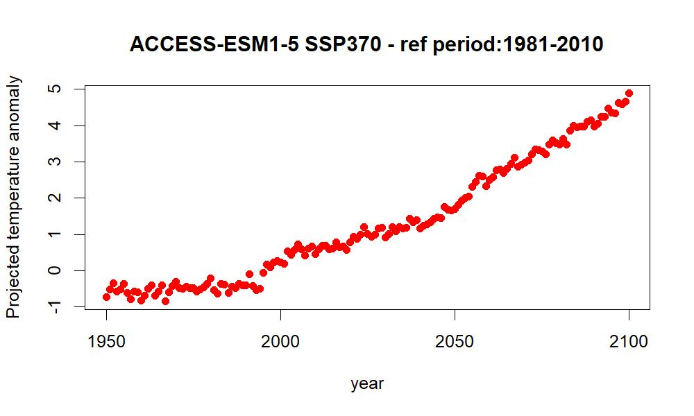

This post contains the scripts provided by Ralph Trancoso in the Analysing Climate Data in R workshop. The recording is also available, just email mitchel.rudge@uq.edu.au for access. 


# 1 Installing and loading the data, and the `raster`, `ncdf4`, `rgdal`, and `ggplot2` packages, setting directory, loading gridded data

To follow this tutorial, you will need to [download some prepared climate data](https://cloudstor.aarnet.edu.au/plus/s/Z35pnzhUEpnK7Gt). 

Save this link to somewhere on you computer, in our example the c drive, the unzip the folder.  


If you don't have the 'raster' and `ncdf4` packages installed, install them:

```{r eval=FALSE}
install.packages("raster") # Installing the packages required for the workshop
install.packages("ncdf4")
install.packages("rgdal")
install.packages("ggplot2")
```


Now load the `raster` package, and set the directory to where you stored the Rclim folder.

Set your home directory, for example, if you put the rclim folder on you C drive:

```{r include=FALSE}
home <- "C:/Users/uqmrudg1/Desktop/Rclim/"
```

```{r eval=FALSE}
home <- "C:/Rclim"
```

Now load the `raster` packages, and set your directory to where the climate data is.  

```{r message=FALSE, warning=FALSE}
library(raster)
setwd(home) #workshop dataset

setwd(paste0(home, "/worldclim")) # Set work directory to worldclim data
#getwd() # get work directory
#dir() # list files in the work directory
?stack # what does stack do?
aus_temp <- stack("tmean_australia_wc.nc")  # Loading gridded #data as RasterStack
```

# 2 Querying the RasterStack data and quick plot using raster::plot and raster::spplot

Below are a whole bunch of checks that you can run on the raster data set.
```{r message=FALSE, warning=FALSE}
ncol(aus_temp) #check the number of columns
nrow(aus_temp) #check the number of rows
ncell(aus_temp) #check the number of cells
nlayers(aus_temp) #check the number of layers
dim(aus_temp) #check the dimensions (rows, columns, layers)

projection(aus_temp) #check the projection
res(aus_temp) #check the resolution
inMemory(aus_temp) #check if the data is stored in memory
fromDisk(aus_temp) #check if the data was read from disk
names(aus_temp) #check the names of the layers
```

Now plot the rasters using the `plot` function:


```{r message=FALSE, warning=FALSE}
plot(aus_temp/10)
```

Or use spplot:
```{r message=FALSE, warning=FALSE}
spplot(aus_temp/10) # lattice plot, returns a trellice 
```


Each layer represents a month of the year, from 1-12. 
So lets rename the layers and plot again.  

```{r message=FALSE, warning=FALSE}
months <- c("Jan", "Feb", "Mar", "Apr", "May", "Jun",
            "Jul", "Aug", "Sep", "Oct", "Nov", "Dec")

names(aus_temp) <- months #set the layer names to months

plot(aus_temp/10)
```

Or, using `spplot` to create a lattice plot

```{r message=FALSE, warning=FALSE}
spplot(aus_temp/10) # lattice plot, returns a trellice 	
```


# 3 Calculating anomalies as gridded time-series and global average

First, load the CMIP6 data set. 

```{r message=FALSE, warning=FALSE}
setwd(paste0(home, "/CMIP6")) # Set work directory to CMIP6 data
proj_temp <- stack("tas_Asea_ACCESS-ESM1-5_ssp370_r1i1p1f1_gr1.5_1950-2100.nc")
names(proj_temp)
```

We can see that these names make no sense. So the names relate to years, we can re-name each layer:

```{r message=FALSE, warning=FALSE}
years <- seq(1950, 2100, by=1)
names(proj_temp ) <- years
names(proj_temp)
```

The X is at the start of each of each year to ensure they are of type character. 

Now we can create a simple function to calculate the temperature anomaly. 

```{r message=FALSE, warning=FALSE}
anomaly <- function(x) {
    anom <-  x - mean(x[[32:61]]) # for reference period 1981-2100
    names(anom) <- seq(1950, 2100, by=1)	
    return(anom)
}
```


```{r message=FALSE, warning=FALSE}
T_anom <- anomaly(proj_temp)
```

Now plot the temperature anomaly, from 1:16 (1950 - 1965)
```{r message=FALSE, warning=FALSE}
spplot(T_anom[[1:16]])
```

And from 2084 - 2100
```{r message=FALSE, warning=FALSE}
spplot(T_anom[[135:151]])
```

Then we can calculate the average temperature anomaly

```{r message=FALSE, warning=FALSE}
T_anom_mean <- as.data.frame(cbind(years, cellStats(T_anom, mean)))
names(T_anom_mean) <- c("year", "T_anom_mean")
```

Finally, we can take a look at the average temperature anomaloy for the entire dataset. 
```{r message=FALSE, warning=FALSE}
setwd(paste0(home, "/output")) #set directory to output
setwd(home) # Set work directory to main folder
dir.create("output")
setwd(paste0(home, "/output"))
jpeg(file="anomaly_ts.jpeg", height = 600,  width = 1000, res=150)
plot(T_anom_mean$year, T_anom_mean$T_anom_mean, type = "p", pch = 19, 
     col = "red", xlab="year", ylab="Projected temperature anomaly", 
     main="ACCESS-ESM1-5 SSP370 - ref period:1981-2010")
dev.off()
```

Have a look in the output folder, you should see something like this




# 4 Handling regions as shapefiles

Here, we load and plot a shapefile of the worlds country boundaries. 

Here, we load and plot a shapefile of the worlds country boundaries. 

```{r message=FALSE, warning=FALSE}
library(rgdal)

setwd(paste0(home, "/shp"))
countries = readOGR(dsn=".", layer="TM_WORLD_BORDERS_SIMPL-0.3")
plot(countries)
```


Or use `spplot` to color by population: 

```{r message=FALSE, warning=FALSE}
spplot(countries, "POP2005")
```


# 5 Regionalizations of climate data - plotting time-series as line plot and bar chart

```{r message=FALSE, warning=FALSE}
library(ggplot2)

setwd(paste0(home, "/CMIP6")) # Set work directory to CMIP6 data
proj_temp <- stack("tas_Asea_ACCESS-ESM1-5_ssp370_r1i1p1f1_gr1.5_1950-2100.nc")
proj_temp <- proj_temp -273.15
names(proj_temp) <- c(seq(1950,2100, by=1))

## From your countries vector we read in, select a country customise your study area for the workshop analysis:
my_country <- subset(countries, NAME == "Australia")


df<- as.data.frame(countries@data)
#fix(df) # to have a look at the dataframe of the countries

mydf <- structure(list(
longitude = c(153.0251, 145.7781, 149.1821, 146.8169, 139.4927, 144.2555), 
latitude = c(-27.4698, -16.9186, -21.1425, -19.2590, -20.7256, -23.4422)), 
.Names = c("longitude", "latitude"), class = "data.frame", row.names = c(NA, -6L))
xy <- mydf[,c(1,2)]
spdf <- SpatialPointsDataFrame(coords = xy, data = mydf, proj4string = CRS("+proj=longlat +datum=WGS84 +ellps=WGS84 +towgs84=0,0,0"))
```

Finally, plot the points we chose on the map of Australia. 
```{r message=FALSE, warning=FALSE}
plot(my_country)
plot(spdf, add=T, col="red")
```

```{r }
proj_temp_cities <- extract(proj_temp, spdf)
proj_temp_cities <- as.data.frame(proj_temp_cities)
proj_temp_cities <-as.data.frame(t(proj_temp_cities))
proj_temp_cities$year <- 1:nrow(proj_temp_cities)+1980
names(proj_temp_cities) <- c("Brisbane", "Cairns", "Mackay", "Townsville", "Mount_Isa", "Longreach", "year")
```

We can plot the projected temperature change of the cities we have selected. 

We can plot the projected temperature change of the cities we have selected. 

```{r}
#install.packages("reshape2")
library(reshape2)
proj_temp_cities_melt <- melt(proj_temp_cities, id="year")

ts1 <- ggplot(proj_temp_cities_melt) +
    geom_line(aes(x=year, y=value, colour=variable)) +
    ggtitle("Projected average temperature ACCESS-ESM1.5 SSP3-7.0") +
    ylab("Temperature (°C)")  +
    scale_color_brewer(name= "cities", palette="Set1") +
    theme_bw() 
ts1
```


# 6 Convertig gridcells to data frame within a study area mask and plotting boxplots in ggplot2

```{r}
setwd(paste0(home, "/IPCC")) # Set work directory to CMIP6 data
dir() 

# Mean temperature
temp_list <- list.files(path= paste0(home, "/IPCC"), pattern = "Mean temperature", full.names = TRUE)
temp_GW <- stack(temp_list)
names(temp_GW) <- c("GW1.5", "GW2.0", "GW3.0", "GW4.0") 
plot(temp_GW)

```


```{r}

#masking data outside country and converting grid to dataframe

temp_GW_country <- as.data.frame(mask(temp_GW, my_country))
dim(temp_GW_country)
head(temp_GW_country)	
temp_GW_country <- na.omit(temp_GW_country)
dim(temp_GW_country)

#install.packages("reshape2")
library(reshape2)
temp_GW_country_m <- melt(temp_GW_country)

#creating a boxplot of avg temp per global warming level on ggplot2

bp1 <- ggplot(temp_GW_country_m, aes(x=variable, y=value, fill=variable)) +
geom_boxplot()+
xlab("Global warming level (°C)")+
ylab("Change in average surface temperature (°C)")+
ggtitle(paste("Change in average surface temperature per global warming level in ", my_country@data$NAME[1], sep="")) +
theme_bw()

bp1 <- bp1 + scale_color_brewer(name= "GW level", palette="YlOrRd") # why it does not work? - change from color to fill
bp1

```


# 7 Repeat the extraction and plot for precipitation and/or other metrics

```{r }
# Total precipitation
prec_list <- list.files(path= paste0(home, "/IPCC"), pattern = "Total precipitation", full.names = TRUE)
prec_GW <- stack(prec_list)
names(prec_GW) <- c("GW1.5", "GW2.0", "GW3.0", "GW4.0") 
plot(prec_GW)
```

```{r}
#masking data outside country and converting grid to dataframe

prec_GW_country <- as.data.frame(mask(prec_GW, my_country))
prec_GW_GW_country <- na.omit(prec_GW_country)
prec_GW_country_m <- melt(prec_GW_country)

#creating a boxplot of precipitation per global warming level on ggplot2

bp2 <- ggplot(prec_GW_country_m, aes(x=variable, y=value, fill=variable)) +
geom_boxplot()+
xlab("Global warming level (°C)")+
ylab("Change in total precipitation (%)")+
ggtitle(paste("Change in total precipitation per global warming level in ", my_country@data$NAME[1], sep="")) +
theme_bw() +
scale_fill_brewer(name= "GW level", palette="YlOrRd")
bp2
```


# Where to find climate data

**IPCC interactive atlas** The authority for climate data is the IPCC. And the interactive atlas has the latest data
https://interactive-atlas.ipcc.ch/regional-information

**Worldclim** Global climate and weather data. WorldClim is a database of high spatial resolution global weather and climate data. https://www.worldclim.org/ 


**SILO** gridded data for Australia until yesterday: https://longpaddock.qld.gov.au/silo/gridded-data/

 
**LongPaddock** Provided by the Queensland Government, gridded data available for a range of variables in NetCDF and GeoTiff formats. The NetCDF datasets are arranged in annual blocks where each file contains all of the grids for the selected year and variable.
https://longpaddock.qld.gov.au
 

**CMIP5 downscaled climate projections over Queensland** High-resolution climate change projections for Queensland using dynamical downscaling of CMIP5 global climate models are available for download in gridded format with spatial resolution of 10 km at Terrestrial Ecosystem Research Network (TERN)
https://longpaddock.qld.gov.au/qld-future-climate/data-info/tern/

# About the author 


<br>
[](https://twitter.com/RalphTrancoso)

Ralph is a research scientist with expertise in climate change, ecohydrology, and deforestation impacts. Ralph is particularly interested in how climate and landscape changes affect the environment and impact society. He is a Principal Climate Change Scientist at the Department of Environment and Science (Queensland Government) and a Research Fellow at the School of Biological Sciences (University of Queensland).