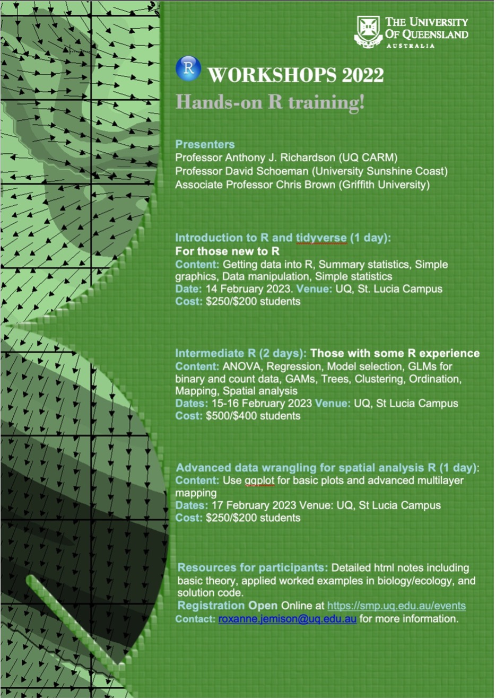

## Geospatial CoP Newsletter, January 2023

### Ringing in 2023 and upcoming plans for the UQ Geospatial CoP

**2023 is going to be a big year for the UQ Geospatial CoP.**

In addition to monthly coding get-togethers, we'd like to kick-start the year with a [survey](https://docs.google.com/forms/d/e/1FAIpQLScyIqFRi1ySR0z0d7u0lSmXu1Vt5_wRq-0aD5bUCml8VziUGQ/viewform) to get input on the following:

1)  **Who is the geospatial community?** Tell us what your career stage is so we can better cater to the demographic of the community.

2)  **What should our new name be?** We'd like to re-brand the community, mainly to remove 'UQ' from the title as over the years the group has grown to include individuals from other universities and organisations.

3)  **Establishing a Code of conduct, mission statement, and organising committee for the group.** More details to come, but if you are interested in volunteering your time to help organise activities throughout the year, please let us know in the survey and/or reach out by email. Roles may include: Speaker facilitator, Website and communications manager, Listserv manager, Treasurer/funding manager, etc.

4)  **Speaker and/or topic recommendations for 2023.** Let us know who the heroes are in your field that you'd like us to invite to speak to the Geospatial community. Alternatively, let us know what topics you are interested in learning about at one of the sessions.

### February meet-up (hybrid, location TBD)

On February 9th (2-4 pm) we'll have our first hybrid coding meet-up of the year, how to calculate areas accurately in R using both vector and raster data.

### Training

Upcoming R courses on statistics and spatial analysis (Feb 14th-17th, [register here](https://smp.uq.edu.au/events)):

