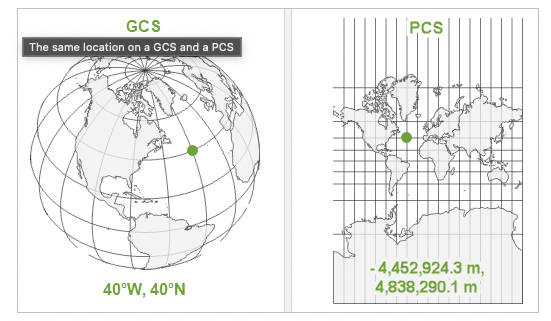

This short tutorial will focus on area calculation in R using both vector and raster data. Use the following code to install all necessary packages

`install.packages('terra', 'tmap', 'sf', 'tidyverse', 'exactextractr', 'rnaturalearthdata', 'microbenchmark')`

**Disclaimer**: the [author](https://github.com/cabuelow) of these notes is by no means an expert on this topic. This is merely a compilation of information I've gathered while going down a googling 'rabbit-hole'. So please get in [touch](mailto:c.buelow@griffith.edu.au) if anything in the notes should be corrected.

### Area in 3-dimensions vs. 2-dimensions

Can I calculate area accurately using a latitude-longitude geographic coordinate reference system (GCS), or should I use a projected coordinate reference system (PCS)?

GCS's represent the Earth's surface in 3-dimensions and have angular, lat-long units (Figure 1). They are defined by a datum (reference points associated with an ellipsoid (a model of the size and shape of the Earth)), a prime meridian, and an angular unit of measure. See [here](https://geocompr.robinlovelace.net/spatial-class.html#geographic-coordinate-systems) for more detail. Calculating area in a 3-D GCS requires geodesic (i.e., ellipsoidal) computations, which can be complex and computationally expensive.

PCS's flatten a GCS into 2-dimensions representing linear units (e.g., metres), helping to make area computations less complex and therefore faster, but also causing some distortion of the Earth's surface. There are many PCS's available to use (see [here](https://www.geo-projections.com/)), some of which preserve area (i.e., equal-area projections).

.

#### Which coordinate reference system to use?

Here we'll focus on how coordinate reference systems influence area calculations. There is a common misconception that you cannot calculate area accurately when in a lat-long GCS, but this is not true. For example, read the help documentation from the `expanse` function in {terra}:

```{r}
?terra::expanse
```

'For vector data, the best way to compute area is to use the longitude/latitude CRS. This is contrary to (erroneous) popular belief that suggest that you should use a planar coordinate reference system.'

More generally however, choosing the best coordinate reference system will depend on the scale and location of your spatial data, and the goal of your analysis. Sometimes you will need to use multiple CRS's to complete various tasks associated with a single analysis. We won't dive into the details here, but find a good overview things to consider when choosing a CRS [here](https://geocompr.robinlovelace.net/reproj-geo-data.html).

Note also that it's always preferable to leave your raster data in it's native projection if your analysis requires use of values stored in the raster pixels. This is because projecting rasters involves calculating new pixel values via resampling, which results in slight inaccuracies and potential loss of information. There are several methods for resampling depending on they type of data stored in the raster pixels (e.g., categorical vs. continuous), see descriptions [here](https://geocompr.robinlovelace.net/geometry-operations.html#resampling).

### Vector area calculations and the new-ish s2 geometry library

Since 2021, {sf} (versions \>1) uses Google's s2 spherical geometry engine by default when representing vector polygons that are in a lat-long GCS. Previously {sf} would use a planar geometry engine called GEOS, meaning that if you were in a 3-D lat-long GCS, {sf} was assuming flat, planar coordinates. This would result in warning messages like:

`although coordinates are longitude/latitude, st_intersects assumes that they are planar`

Now, when the s2 spherical geometry is on and your data is in a 3-D lat-long GCS, {sf} performs processes and computations on a sphere, rather than in 2-D. The advantages of using the s2 geometry library instead of GEOS are outlined in detail here: r-spatial.github.io/sf/articles/sf7.html. If your data is in a 2-D PCS, {sf} reverts to the planar GEOS geometry engine, assuming flat coordinates (so make sure you're using a projection that preserves area).

#### Should I have s2 turned on when calculating area in a geographic CRS?

While the s2 geometry library offers many advantages, when it comes to area there is a speed vs. accuracy trade-off. When s2 is on, {sf} calculates area assuming a spherical approximation of the Earth. But the Earth isn't a perfect sphere, it's a **spheroid**. It bulges at the equator.

When s2 is off, {sf} performs geodesic (i.e., ellipsoidal) area calculations using the high precision [GeographicLib](https://geographiclib.sourceforge.io/) that uses a spheroid to represent the Earth's size and shape. Geodesic calculations will be more accurate than those performed with s2 on, as s2 assumes a spherical representation of the Earth. But geodesic computations more complex, and time costly.

Let's examine the speed vs. accuracy trade-off. We'll start by loading some vector polygons representing countries of the world and check if the geometries are valid.

```{r, warning = FALSE}
library(tidyverse)
library(sf)
library(tmap)
options(scipen=999)
tmap_mode('view')

sf_use_s2() # check if s2 is on (it should be as default when sf is loaded)
dat <- rnaturalearthdata::countries50 %>% # load country polygons for the world
  st_as_sf() %>% # turn into a simple features dataframe
  filter(admin == 'Sudan') # filter for a single country
st_is_valid(dat) # check if geometry is valid
```

The geometry is invalid. Compared to GEOS, s2 has strict polygon conformance that if violated will render invalid geometries. For vector data created in older versions of `sf`, this can be a bit of a headache. First thing is to try fixing the geometry.

```{r}
dat_v <- dat %>% st_make_valid()
st_is_valid(dat_v) # check if geometry is valid
qtm(dat_v)
```

It works in this case - the geometry is valid. Now, let's compare area estimates with s2 on and off.

```{r}
area_s2 <- st_area(dat_v)/1e6 # area in km2, s2 on by default
sf_use_s2(FALSE) # turn off s2
area_GeoLib <- st_area(dat_v)/1e6 # area in km2, s2 off, sf calculates geodesic area using GeographicLib
area_s2 - area_GeoLib # subtract to get the difference in area estimates 
```

There is an \~6000 km2 difference in area (note the m2 indicated in the output is incorrect, because we divided by 1e6 to convert m2 to km2). The geodesic calculation using the GeographicLib (i.e, s2 turned off) will be the most accurate estimate because it doesn't assume the Earth is a perfect sphere. But which is faster? Let's use {microbenchmark} to find out.

```{r, warning = FALSE}
library(microbenchmark)

microbenchmark(
  {sf_use_s2(TRUE); area_s2 <- st_area(dat_v)},
  {sf_use_s2(FALSE); area_GeoLib <- st_area(dat_v)})
```

So computing geodesic area takes more time. In this case it's only a few milliseconds, so we would turn s2 off and opt for the most accurate, albeit slower, area calculation.

How do geodesic area computations using a lat-long GCS compare to an equal-area PCS, like mollweide?

```{r}
dat_p <- dat_v %>% st_transform('ESRI:54009')
area_mollweide <- st_area(dat_p)/1e6 # sf uses planar geometry library GEOS
area_mollweide - (area_GeoLib/1e6)
```

There is an \~ 10000 km2 difference in area estimates, much larger than the difference between area on a sphere (s2 on) and on a spheroid (s2 off, geodesic estimates using GeographicLib).

#### In summary...

When calculating area of vector polygons in a lat-long GCS using {sf}, it's best to turn-off s2 and let {sf} calculate area on an ellipsoid (instead of a spherical approximation of the Earth). However, if speed is an issue and you're not as worried about accuracy, leave s2 on and calculate area using on a sphere.

If you're calculating area in an equal-area PCS using {sf}, it doesn't matter if s2 is on or off, area will be calculated using GEOS planar geometry engine.

### Raster area calculations

Like {sf}, if your raster data is in a lat-long GCS, {terra} will compute area in meters squared using geodesic computations based on your spatial data's ellipsoid with GeographicLib.

Note that {terra} also has a class for vector data, called 'SpatVectors' (raster objects are called 'SpatRasters'). So we can also calculate area of vector data with {terra}. {sf} should provide the same estimate of area if s2 is turned off, meaning it is using GeographicLib for lat-long GCS computations. Let's see if this is the case.

*Note*: The workflows below are borrowed from [here](https://stackoverflow.com/questions/68322863/is-this-flow-to-extract-the-area-of-all-pixels-2-within-a-polygon-layer-corre).

First, we'll create a polygon and a raster.

```{r}
library(terra)
#| warning: false
sf_use_s2(TRUE) # make sure s2 is on (we already have sf loaded)
r <- rast(nrows=10, ncols=10, xmin=0, ymin=0, xmax=10, ymax=10) # make a raster
r <- init(r, 8) # initialise a spatraster with values
p <- vect('POLYGON ((2 2, 7 6, 4 9, 2 2))', crs = crs(r)) # make a vector polygon
r_mask <- mask(r, p) # mask the raster to the polygon
qtm(r) + qtm(r_mask) + qtm(st_as_sf(p))
```

Try toggling the different layers on and off in the interactive map to see what the mask does.

*Note* that the raster pixels cover a larger area than the polygon. By default 'mask' includes all raster pixels that the polygon touches. We could use the `disagg` function to reduce the resolution and better match the area of the raster to the area of the polygon (but we won't do that here).

Now let's compare area estimates with {terra} and {sf}.

```{r}
area_t <- expanse(p, unit = 'km') # here 'terra' is computing geodesic area (i.e., based on a spheroid, not planar)
sf_use_s2(FALSE) # turn off s2 to uses the GeographicLig
area_sf <- st_area(st_as_sf(p))/1e6 # here 'sf' using GEOS to calculate area
round(area_t - as.numeric(area_sf))
```

Great, so as we expect, no difference in area estimates between {terra} and {sf} when s2 geometry library is turned off.

#### Compute area of raster data using {terra}

Let's use {terra} to compute the area of a raster that intersects with a vector polygon. We'll use the functions `cellSize` and `mask` from {terra}.

```{r}
r_area <- cellSize(r_mask, unit="km") # create a raster where pixel values are area in km2
qtm(r_area) + qtm(st_as_sf(p)) # have a quick look
e <- extract(r_area, p, exact=TRUE) # extract pixel values that intersect with vector polygon, and get fraction of each cell that is covered
area_t - sum(e$area * e$fraction) # calculate difference between area of the vector polygon, and the estimate of area of the 'raster'
```

There is a 165 km2 difference in area calculated using a raster vs. vector polygon.

#### Compute area of raster data using {exactextractr}

{exactextractr} can be used to perform raster computations within vector polygon areas very quickly, and it can do similar things as {terra}'s `extract` function that we used above. However, it uses a spherical approximation of the Earth, rather than a spheroid. Let's compare estimates of area between {terra} and {exactextractr}.

```{r}
library(exactextractr)

e2 <- exact_extract(r_area, st_as_sf(p))[[1]]
sum(e$area * e$fraction) - sum(e2$value * e2$coverage_fraction)
```

The difference in area is very minor, \~18 km2. Which is faster?

```{r}
microbenchmark(extract(r_area, p, exact=TRUE), 
               exact_extract(r_area, st_as_sf(p)))
```

{terra} wins! So in this case there is no speed vs. accuracy trade-off. {terra} is faster and more accurate, because it is not assuming that the Earth is a sphere to make area calculations.

#### Comparing PCS area computations between {terra} and {sf}

Do estimates of vector polygon area differ between {terra} and {sf} when in an equal-area PCS, like mollweide?

```{r}
area_t_mollweide <- expanse(vect(dat_p), 'km', transform = F)
round(as.numeric(area_mollweide) - area_t_mollweide)
```

No difference.

#### In summary...

If using a lat-long GCS to calculate area in R, {terra} and {sf} will provide the same estimates for vector polygons, as long as s2 is turned off. For raster areas in polygons, {terra} is faster and more accurate than {exactextractr}.
